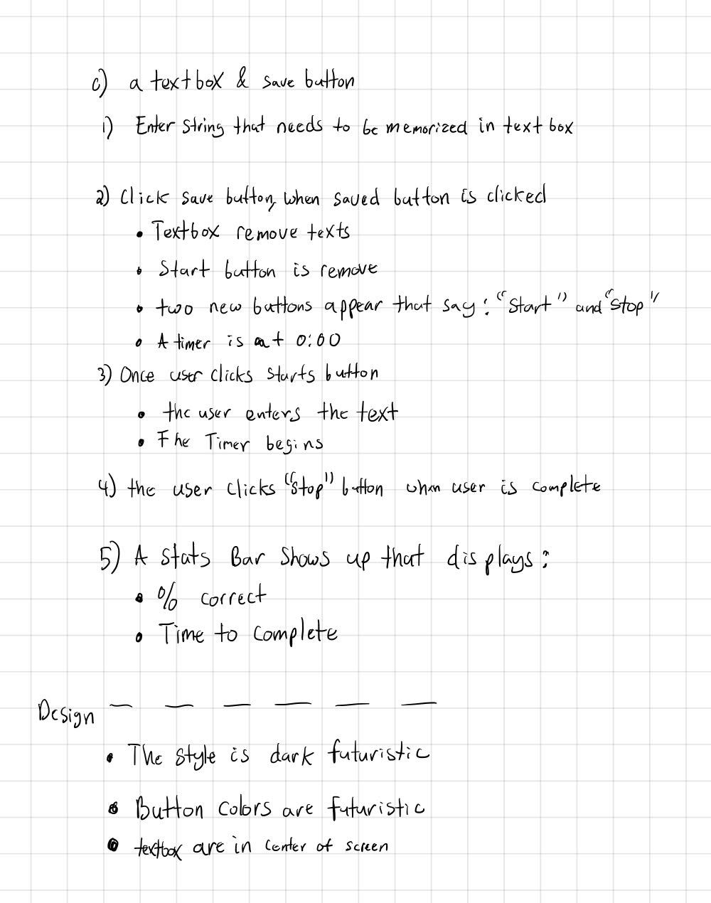
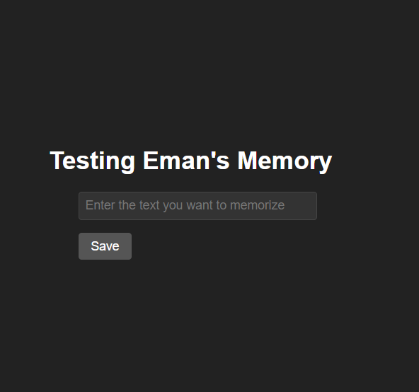
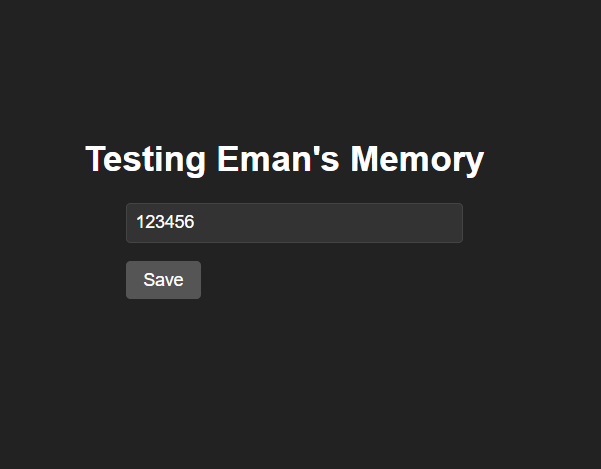
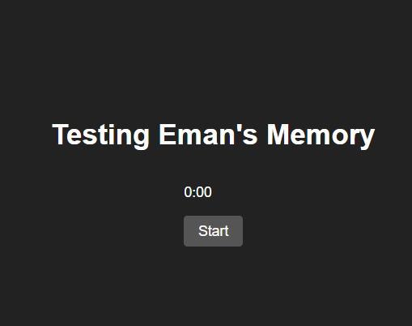
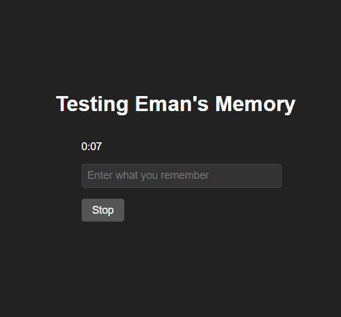
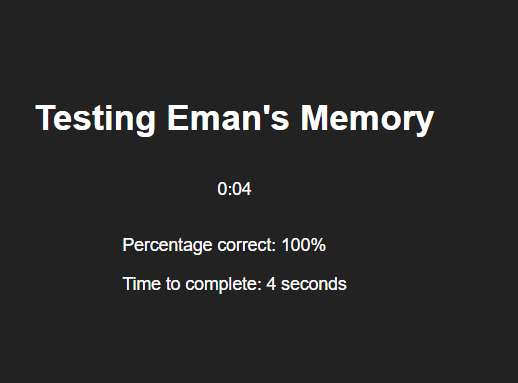

# project-1-enhancing-my-memory

Purpose: I am in the process of becoming better developer, computer scientist, and data scientist. I am using this project to my ability to organize my thoughts and ideas. I am also using this project to practice my skills in writing and presenting my ideas to ChatGPT and other things.

## Future Design & Functionality Ideas:
 

### My Ideas based on what I want to enhance:

#### Current Version:

##### Level 1:

## Today
* [ ] Use this for e numbers Process for only 40 e numbers (1 set) - Multiple Steps

    - [ ] The *User* **selects** a group from a dropdown menu with options {A-F}.
    - [ ] The *User* **clicks** a "Begin" button.
    - [ ] The *User* **selects** either "1 line" or "entire group" from a dropdown menu, with "1 line" as the default option.
    - [ ] If the *User* **selects** "entire group", they will be prompted to select a set from another dropdown menu with options 1-5.
    - [ ] The *User* **clicks** a "Let's Start" button to proceed.
    - [ ] The *User* is then presented with:
    - [ ] A text display above the input text box that shows the selected group and set, formatted as "Group: [selected group], Set: [selected set]".
    - [ ] An input text box for the *User* to enter the text corresponding to the selected group and set.

* [ ] Filter word numbers and letters and display it on the screen
* [ ] Display selected groups and sets
* [ ] Center all Text * use bootstrap to make everything look nice
* [ ] Give the ability to set a time goal
* [ ] If goal is not met, take points off
* [ ] Create a score board

## Later
* [ ] Use this for e numbers Process for an entire group (A-F)
* [ ] Save scores in a database
* [ ] Perform unit testing
* [ ] Create a visualization of past scores

 #### In a future version:
* [ ] Use this for music chords  Process

 ### ChatGPT's Questions:

- Do you have any specific requirements for the database that stores the memorized content?
- Will users need to create an account or log in to use the website?
- How will you ensure the security of user data and prevent unauthorized access to it?
- Do you have any additional features or functionality that you would like to include in the project?
- What is the target audience for this website?
- Do you have any design or branding guidelines that I should be aware of?
- What is the timeline for this project? Do you have any specific deadlines?
- Are there any other details that you would like to share about the project?

## Original Design & Function of App 

Develop this app please
## Name of the project: Memorize

**Description of the project:** Memorize is a website that allows you to memorize anything you want. 
0) A title name: Testing Eman's memory, a textbox, and save button are the only things on the screen
1) The *User* **enters** the string that needs to be memorized in textbox
2) The *User* **clicks** save button, when saved button is clicked:
    - The textbox and save button disappear, entered text is stored in local storage
    - Two new buttons appear that say: "start" and "stop"
    - A timer is at 0:00
3) Once the *User* **clicks** the "start" button:
    - The user enters the what they remember in textbox
    - The timer begins
    - The website is calculating the % correct as the *User* is typing
4) The *User* **clicks** the "stop" button when the *User* is complete then a stats bar shows up that displays:
    - % correct
    - Time to complete
Design 
    - The style is dark futuristic
    - Everything is center on this page

What programming languages and technologies are you using for this project? :HTML, CSS, and JavaScript
This version is only for me

## Image of Image of Original Design & Function of App

### Origial Idea Written

 

### First Page

 

### Enter Original Text & Click Save Button

###  Click Start Button

### Enter Text & Click Stop Button

### Stats Bar

